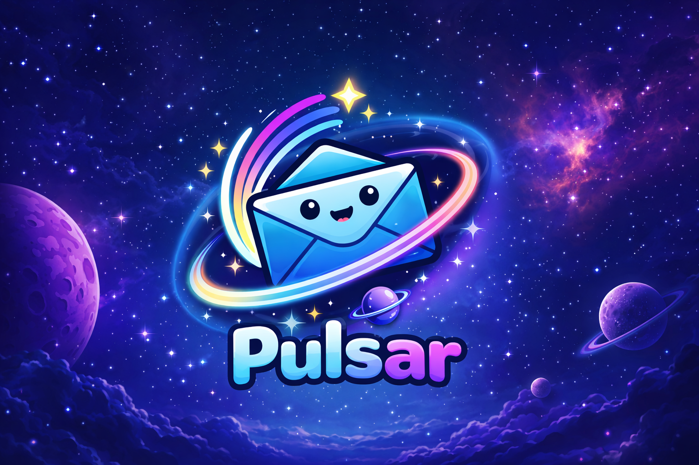

<p align="center">
  
</p>

# ✨ Pulsar

> A beautiful local SMTP mail server for development

Pulsar is a modern desktop application that captures and displays emails sent by your applications during development. Stop worrying about test emails cluttering real inboxes or configuring complex mail services. Pulsar provides a simple, elegant solution for testing email functionality locally.

Perfect for developers working with Laravel, Node.js, Ruby on Rails, PHP, and any other framework that sends emails.

## Why Pulsar?

When developing applications that send emails, you need a way to test email functionality without:
- Sending emails to real addresses
- Configuring external mail services
- Managing API keys or credentials
- Worrying about deliverability or spam filters

Pulsar runs entirely on your local machine, capturing all emails your application sends and displaying them in a beautiful, easy-to-use interface.

## ✨ Features

### Core Functionality
- 📧 **Local SMTP Server** - Runs entirely on your machine (default port 2500, fully configurable)
- 📬 **Smart Mailboxes** - Automatically creates mailboxes based on SMTP username for organized email management
- 💾 **Persistent Storage** - All emails stored in SQLite database, survive app restarts
- 🔄 **Real-time Updates** - New emails appear instantly with desktop notifications
- 🔒 **Privacy First** - All data stays on your machine, no external connections

### Email Viewing
- 🎨 **Beautiful UI** - Clean, modern interface built with React and Tailwind CSS
- 👀 **Multiple Views** - Switch between formatted HTML/text, headers table, and raw RFC822 source
- 📎 **Attachment Support** - View, open, and save email attachments with ease
- 🔒 **Safe Rendering** - HTML emails rendered in sandboxed iframes for security

### Productivity Features
- ⚙️ **Settings Panel** - Configure SMTP port directly from the UI
- 📚 **Setup Instructions** - Built-in guides for Laravel, Rails, Node.js, PHP, Symfony, WordPress, and more
- ✅ **Bulk Actions** - Select and delete multiple emails at once
- 🗑️ **Quick Delete** - Delete individual emails with one click
- 🔔 **Desktop Notifications** - Get notified when new emails arrive
- 📊 **Unread Counts** - See unread email counts in mailbox list and dock/taskbar badge

## 📥 Installation

### Download Pre-built Binaries

Download the latest release for your platform from the [releases page](https://github.com/joelmale/pulsar/releases):

- **macOS**: Download `Pulsar-{version}-arm64.dmg` or `Pulsar-{version}-arm64-mac.zip`
- **Windows**: Download `Pulsar-Setup-{version}.exe` or `Pulsar-{version}-portable.exe`
- **Linux**: Download `Pulsar-{version}.AppImage` or `pulsar_{version}_amd64.deb`

### Build from Source

```bash
# Clone the repository
git clone https://github.com/joelmale/pulsar.git
cd pulsar

# Install dependencies
npm install

# Run in development mode
npm run dev

# Build for production
npm run build

# Package for your platform
npm run package:mac    # macOS
npm run package:win    # Windows
npm run package:linux  # Linux
```

## 🚀 Quick Start

1. **Launch Pulsar** - Open the application
2. **Note the connection details** - Default is `127.0.0.1:2500`
3. **Click the port/IP in the sidebar** - Opens setup instructions for your framework
4. **Configure your app** - Use the provided configuration examples
5. **Send a test email** - Watch it appear instantly in Pulsar!

## 📖 Configuration Examples

Pulsar includes built-in setup instructions for popular frameworks. Click the "Port • 127.0.0.1" button in the app to access them.

### Laravel

#### Laravel

Update your `.env` file:

```env
MAIL_MAILER=smtp
MAIL_HOST=127.0.0.1
MAIL_PORT=2500
MAIL_USERNAME=my-app-mailbox
MAIL_PASSWORD=anything
MAIL_ENCRYPTION=null
MAIL_FROM_ADDRESS=noreply@myapp.test
MAIL_FROM_NAME="${APP_NAME}"
```

The `MAIL_USERNAME` determines which mailbox receives the emails. For example, if you set `MAIL_USERNAME=orders`, all emails will appear in a mailbox named "orders".

#### Node.js (Nodemailer)

```javascript
const nodemailer = require('nodemailer');

const transporter = nodemailer.createTransport({
  host: '127.0.0.1',
  port: 2500,
  secure: false, // No TLS
  auth: {
    user: 'my-app-mailbox', // This becomes the mailbox name
    pass: 'anything'        // Password is not validated
  }
});

await transporter.sendMail({
  from: 'sender@example.com',
  to: 'recipient@example.com',
  subject: 'Test Email',
  text: 'Hello from Pulsar!',
  html: '<h1>Hello from Pulsar!</h1>'
});
```

#### Testing with cURL

```bash
echo "Subject: Test Email
From: sender@example.com
To: recipient@example.com

This is a test email from curl!" | curl smtp://localhost:2500 \
  --mail-from sender@example.com \
  --mail-rcpt recipient@example.com \
  --user testuser:password \
  --upload-file -
```

### Using the Interface

1. **Mailboxes** - Left sidebar shows all mailboxes with unread counts
2. **Email List** - Middle panel displays emails with checkboxes for bulk actions
3. **Email Viewer** - Right panel shows selected email with three views:
   - **Email**: Rendered HTML or formatted plain text
   - **Headers**: All email headers in a searchable table
   - **Raw**: Complete RFC822 message source
4. **Settings** - Click the gear icon to configure SMTP port
5. **Instructions** - Click "Port • 127.0.0.1" for framework setup guides

## ⚙️ Settings & Configuration

### Changing the SMTP Port

1. Click the **Settings** button in the sidebar
2. Enter your desired port number
3. Click **Save** - the server restarts automatically

### Database Location

Emails are stored locally in SQLite:

- **macOS**: `~/Library/Application Support/pulsar/pulsar.db`
- **Windows**: `%APPDATA%/pulsar/pulsar.db`
- **Linux**: `~/.config/pulsar/pulsar.db`

### Docker & Virtual Machines

- **Vagrant/Homestead**: Use `10.0.2.2` as your SMTP host
- **Docker**: Use `host.docker.internal` as your SMTP host

## 🗺️ Roadmap

Pulsar is under active development. Here are some features planned for future releases:

### Coming Soon
- 📤 **Email Forwarding** - Automatically forward captured emails to a real email address for testing deliverability
- 🌐 **Remote Mailboxes** - Share mailboxes across your team or access them from multiple machines
- 🔍 **Advanced Search** - Search emails by subject, sender, date range, or content
- 🏷️ **Labels & Filters** - Organize emails with custom labels and automatic filtering rules
- 📱 **Mobile Companion App** - View captured emails on your phone or tablet
- 🔗 **Webhook Support** - Trigger webhooks when emails are received
- 📊 **Email Analytics** - Track open rates, link clicks, and email patterns during testing

### Under Consideration
- 🔐 **Team Collaboration** - Share mailboxes with team members securely
- ☁️ **Cloud Sync** - Optional cloud backup and sync across devices
- 🎨 **Custom Themes** - Dark mode and customizable color schemes
- 🔌 **Plugin System** - Extend Pulsar with custom functionality
- 📧 **IMAP Support** - Access Pulsar mailboxes via IMAP clients

Want to request a feature? [Open a discussion](https://github.com/joelmale/pulsar/discussions) or [create an issue](https://github.com/joelmale/pulsar/issues)!

## 🛠️ Development

### Project Structure

```
pulsar/
├── src/
│   ├── main/              # Electron main process
│   │   ├── index.ts       # Application entry point
│   │   ├── smtp/          # SMTP server implementation
│   │   ├── database/      # SQLite database layer
│   │   └── ipc/           # IPC handlers
│   ├── preload/           # Preload scripts
│   │   └── index.ts       # contextBridge API
│   └── renderer/          # React application
│       ├── components/    # React components
│       ├── hooks/         # Custom hooks
│       └── styles/        # CSS styles
└── package.json
```

### Tech Stack

- **Electron** - Desktop app framework
- **React** - UI library
- **TypeScript** - Type safety
- **Tailwind CSS** - Styling
- **Vite** - Build tool
- **better-sqlite3** - SQLite database
- **smtp-server** - SMTP server implementation
- **mailparser** - Email parsing

### Running in Development

```bash
npm run dev
```

This starts Vite's dev server with hot module replacement and launches Electron.

### Building

```bash
# Build renderer (React app)
npm run build:renderer

# Build main process
npm run build:main

# Package the application
npm run package

# Build for all platforms
npm run package:all
```

## 🤝 Contributing

Contributions are welcome and encouraged! Whether you want to:
- 🐛 Report a bug
- 💡 Suggest a feature
- 📝 Improve documentation
- 🔧 Submit a pull request

Please check out our [issues page](https://github.com/joelmale/pulsar/issues) or [start a discussion](https://github.com/joelmale/pulsar/discussions).

### Development Setup

```bash
git clone https://github.com/joelmale/pulsar.git
cd pulsar
npm install
npm run dev  # Starts app in development mode
```

## 📄 License

MIT License - see [LICENSE](LICENSE) for details.

## ❓ Troubleshooting

### Port Already in Use

**Error**: "Port 2500 is already in use"

**Solutions**:
1. Close any other application using that port
2. Change Pulsar's port via **Settings** → enter new port → **Save**

### Emails Not Appearing

**Issue**: Sent emails don't show up in Pulsar

**Checklist**:
1. ✅ Verify SMTP host is `127.0.0.1` (or `10.0.2.2` for Vagrant, `host.docker.internal` for Docker)
2. ✅ Check the port matches what's shown in Pulsar's sidebar
3. ✅ Ensure SMTP credentials include a username (this becomes the mailbox name)
4. ✅ Look for errors in your application's logs

### HTML Not Rendering Properly

HTML emails are rendered in a sandboxed iframe for security. External resources (images, stylesheets from CDNs) may not load. This is intentional to prevent tracking and security issues.

### Database Issues

To reset your database and start fresh:

1. Close Pulsar
2. Delete the database file:
   - macOS: `rm ~/Library/Application\ Support/pulsar/pulsar.db`
   - Windows: Delete `%APPDATA%\pulsar\pulsar.db`
   - Linux: `rm ~/.config/pulsar/pulsar.db`
3. Restart Pulsar

## 💬 Support

- 🐛 **Bug Reports**: [GitHub Issues](https://github.com/joelmale/pulsar/issues)
- 💡 **Feature Requests**: [GitHub Discussions](https://github.com/joelmale/pulsar/discussions)
- ⭐ **Star the Project**: Help others discover Pulsar!

## 🙏 Acknowledgments

- Icon: Custom pulsar star design
- Inspired by [MailHog](https://github.com/mailhog/MailHog) and [MailCatcher](https://mailcatcher.me/)
- Built with [Electron](https://www.electronjs.org/), [React](https://react.dev/), and [Tailwind CSS](https://tailwindcss.com/)

---

<p align="center">
  Made with ❤️ by <a href="https://github.com/joelmale">Joel Male</a>
</p>

<p align="center">
  <a href="https://github.com/joelmale/pulsar">⭐ Star on GitHub</a> •
  <a href="https://github.com/joelmale/pulsar/issues">🐛 Report Bug</a> •
  <a href="https://github.com/joelmale/pulsar/discussions">💡 Request Feature</a>
</p>
